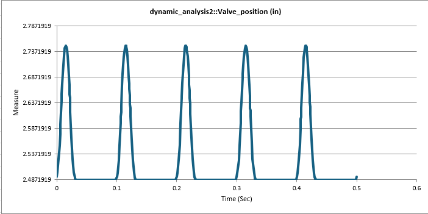
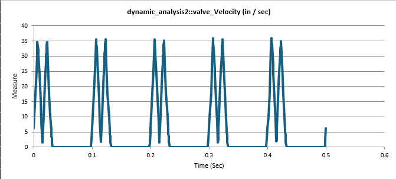
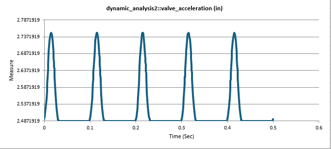
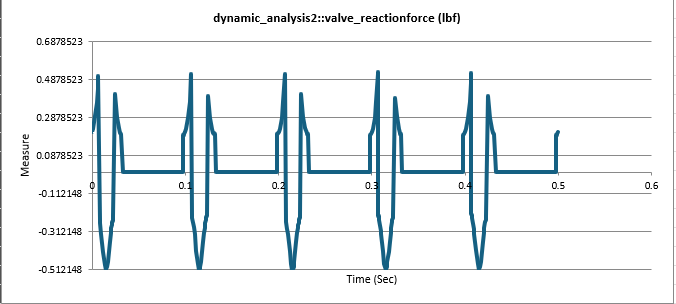

# Cam Follower Mechanism

*The animation shows the camshaft driving the pushrod and rocker arm while the valve returns through spring force.*

## Overview

This project demonstrates the modeling and kinematic simulation of a cam–follower mechanism using **PTC Creo Mechanism**. The objective of the model is to convert rotational motion from a camshaft into linear motion of a valve system while analyzing the resulting position, velocity, acceleration, and reaction forces.

Cam mechanisms are commonly used in engines and automated mechanical systems where precise timing and motion control are required.

---

## CAD Software

PTC Creo Parametric  
Creo Mechanism Module

---

## Assembly Components

| Component | Function |
|----------|----------|
| Camshaft | Input component driven by rotational motion |
| Pushrod | Transfers motion from cam to rocker |
| Rocker Arm | Converts linear pushrod motion into valve actuation |
| Valve | Output element that moves vertically |
| Spring | Maintains follower contact with cam profile |

---

## Mechanical Principle

The cam profile drives the follower through surface contact, converting rotational motion into reciprocating motion.

Cam motion produces:

ω → rotational motion  
x(t) → follower displacement

Follower velocity and acceleration can be expressed as:

v(t) = dx/dt  
a(t) = d²x/dt²

These relationships were analyzed using kinematic simulation in Creo.

---

## Simulation Setup

The mechanism was defined using the following constraints:

- **Pin joints** for rotating components
- **Slider joints** for the valve motion
- **Cam-follower higher-pair contact**
- **Spring element** to maintain follower contact
- **Constant angular velocity motor** applied to the camshaft

A dynamic analysis was then performed to measure system behavior during cam rotation.

---

## Kinematic Results

The simulation tracked the following system responses:

### Valve Position

### Valve Velocity

### Valve Acceleration

### Reaction Force

These plots illustrate how the cam profile controls valve timing and force transmission during operation.

---

## Engineering Drawing

A fully dimensioned engineering drawing of the camshaft component is included:

📄 **camshaft.pdf**

The drawing specifies:

- material selection
- dimensional tolerances
- geometric features

---

## Skills Demonstrated

- Parametric CAD modeling
- Mechanical assemblies
- Cam–follower mechanism design
- Dynamic motion simulation
- Kinematic analysis
- Engineering documentation

---

## Repository Structure
